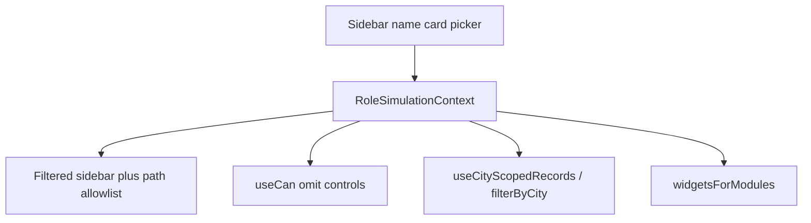

# Role Simulation

This document is the playbook for simulating roles in MaxOne FleetOps. Follow it when adding or changing a role so nav, actions, list data, and the dashboard stay consistent.

This is **frontend simulation**, not backend RBAC. There is no server-side authorization. Switching the sidebar name card changes what the UI shows. The choice is stored in `localStorage` under `maxone.simulationMode`.

## Table of contents

- [Mental model](#mental-model)
- [Key files](#key-files)
- [Conventions](#conventions)
- [Current roles](#current-roles)
- [Permission catalog](#permission-catalog)
- [Nav item ids](#nav-item-ids)
- [Data scope](#data-scope)
- [Dashboard widgets](#dashboard-widgets)
- [Add a new role](#add-a-new-role)
- [Add a permission key](#add-a-permission-key)
- [Add a city scope](#add-a-city-scope)
- [Add a dashboard widget](#add-a-dashboard-widget)
- [Verify](#verify)
- [Known limitations](#known-limitations)

## Mental model

**Full Build** is the default. App Switcher is on. Every module is visible. Every permission is granted. Data is unscoped (all cities).

A **role** is four things, all defined on `RoleDefinition` in [`src/data/rolePermissions.ts`](../src/data/rolePermissions.ts):

1. **Nav** — `navItemIds`: sidebar item `id`s this role may see (include parent folders).
2. **Actions** — `permissions`: allow-list of `PermissionKey`s. Omit a key to hide the control.
3. **Data scope** — optional `dataScope` (today: `{ type: "city", city: "Lagos" }`). Omit for unscoped data.
4. **Dashboard** — **not** configured on the role. Widgets are derived from `navItemIds` via `MODULE_WIDGETS` in [`src/data/dashboardWidgets.ts`](../src/data/dashboardWidgets.ts).



In role mode the App Switcher is hidden. The user stays in Fleet Ops (or whatever `navItemIds` allow). Deep links to hidden modules redirect to a fallback path (usually `/dashboard`).

## Key files

| File | Role |
|---|---|
| [`src/data/rolePermissions.ts`](../src/data/rolePermissions.ts) | `SimulationMode`, `RoleDefinition`, permission keys, nav allowlist, path allow/deny |
| [`src/contexts/RoleSimulationContext.tsx`](../src/contexts/RoleSimulationContext.tsx) | Mode persistence, `can()`, `dataScope`, `filterByCity`, `useCityScopedRecords` |
| [`src/data/sidebarConfig.ts`](../src/data/sidebarConfig.ts) | Sidebar item `id`s and hrefs |
| [`src/data/cityScope.ts`](../src/data/cityScope.ts) | City matcher and Lagos sub-cities |
| [`src/data/dashboardWidgets.ts`](../src/data/dashboardWidgets.ts) | Widget catalog, module mapping, city-scoped numbers and titles |
| [`src/components/max/Sidebar.tsx`](../src/components/max/Sidebar.tsx) | Name-card picker (`SIMULATION_OPTIONS`) |
| [`src/components/max/AppLayout.tsx`](../src/components/max/AppLayout.tsx) | Nav filter, App Switcher visibility, deep-link guard |
| [`src/main.tsx`](../src/main.tsx) | `RoleSimulationProvider` wraps the app |

## Conventions

Follow these on every new role and every new gated action.

- **Hide, do not disable.** Restricted buttons, columns, and routes are omitted. Do not render a greyed-out control.
- **Permissions are allow-list.** `useCan("x")` is true only if `x` is in the role’s `permissions`. Full Build grants `ALL_PERMISSIONS`. A role with an empty `permissions` array is view-only on every gated control.
- **Ungated pages stay fully usable.** If a page has no `useCan` check, any role that can open the module can perform every action on that page. Only add a permission key when you need to restrict someone.
- **Unmentioned modules stay hidden.** If a leaf is not in `navItemIds`, it is not in the sidebar. Include parent ids when children should show (`inbound` for batches, `asset-reassignment` for kit, `maintenance` for service schedule, `disposal-auction` for disposal children).
- **Widgets belong to leaf modules, not roles.** Do not attach widgets to a `RoleDefinition`. If the role has `fleet-register` in `navItemIds`, it gets the Fleet Register widgets. City-scoped roles keep the same catalog; only numbers, subtitles, and “by City” vs “by Sub-City” titles change.
- **City matching is centralized.** Use `isInCityScope` / `useCityScopedRecords` / `filterByCity`. Do not write `includes("Lagos")` on pages.
- **Ikeja, Lekki, Victoria Island, and Surulere are Lagos sub-cities**, not cities. Dashboard charts for a city-scoped role say “by Sub-City”.
- **Vehicle Master Data (`inbound-stock-setup`) is reference data.** Do not city-filter it.
- **Stat tabs and pagination** must count the filtered set, not the global mocks.
- **Out-of-scope detail URLs** redirect to the module list. Check `filterByCity` on the record’s location or destination.

## Current roles

These are the templates to copy. Both Fleet Ops roles share the same `navItemIds`. Differences are permissions and data scope.

| | Full Build | Global Fleet Manager | City Fleet Officer |
|---|---|---|---|
| Picker label | Full Build | Global Fleet Manager | City Fleet Officer |
| App Switcher | Yes | No | No |
| Nav | All apps / modules | Fleet Ops allowlist below | Same as GFM |
| Data | All cities | All cities | Lagos only |
| Dashboard widgets | All catalog widgets (includes Activation Queue) | `fleet-register` + `asset-movement` | Same widgets as GFM, Lagos numbers |
| Gated Fleet Register | All actions and columns | No Add / Bulk Update / Edit Vehicle Info; hide Contract Risk and Collection % | Same as GFM |
| Inbound batches / stock setup | All mutations | View only | View only |
| Activation Readiness | Update + Bulk Upload | None | Update + Bulk Upload |
| Vehicle Document | Upload + Replace | None | Upload + Replace |
| Kit | Reassignment | None; `/kit/assign` blocked | Reassignment allowed |
| Refurbishment / Service / Disposal | Ungated | Ungated | Ungated |

Hidden for GFM and City Fleet Officer (not in `navItemIds`): Ownership Transfer, Auction, Closed Assets, Predictive Lab, Control, and every non–Fleet Ops app (Driver Growth, Driver Experience, Falcon, Portfolio).

Activation Queue stays off for these roles because they do not have Driver Growth / `activation-dashboard`.

Kit assign path `/activation-assignment/asset-reassignment/kit/assign` is denied for **Global Fleet Manager only** (`getDeniedPathPrefixes`). City Fleet Officer may open it.

## Permission catalog

Full Build has every key. GFM has none. City Fleet Officer has the five marked below.

| Key | Where it is used | Full Build | GFM | CFO |
|---|---|---|---|---|
| `fleetRegister.addVehicles` | [`VehiclesPage.tsx`](../src/pages/VehiclesPage.tsx) — Add Vehicles | Yes | — | — |
| `fleetRegister.bulkUpdate` | [`VehiclesPage.tsx`](../src/pages/VehiclesPage.tsx) — Bulk Update | Yes | — | — |
| `fleetRegister.editVehicle` | [`VehicleDetailsPage.tsx`](../src/pages/VehicleDetailsPage.tsx) — Edit Vehicle Info | Yes | — | — |
| `fleetRegister.column.contractRisk` | [`VehiclesPage.tsx`](../src/pages/VehiclesPage.tsx) — column | Yes | — | — |
| `fleetRegister.column.collectionPercent` | [`VehiclesPage.tsx`](../src/pages/VehiclesPage.tsx) — column | Yes | — | — |
| `inbound.batches.create` | [`BatchesPage.tsx`](../src/pages/BatchesPage.tsx) | Yes | — | — |
| `inbound.batches.addIdentifier` | [`VehicleIdsTab.tsx`](../src/pages/batch-details/VehicleIdsTab.tsx) | Yes | — | — |
| `inbound.batches.editIdentifier` | [`VehicleIdsTab.tsx`](../src/pages/batch-details/VehicleIdsTab.tsx) | Yes | — | — |
| `inbound.batches.uploadCsv` | [`VehicleIdsTab.tsx`](../src/pages/batch-details/VehicleIdsTab.tsx) | Yes | — | — |
| `inbound.batches.uploadDocuments` | [`DocumentsTab.tsx`](../src/pages/batch-details/DocumentsTab.tsx) | Yes | — | — |
| `inbound.batches.moveSubBatchStage` | [`SubBatchDetailsPage.tsx`](../src/pages/SubBatchDetailsPage.tsx) | Yes | — | — |
| `inbound.stockSetup.add` | [`StockSetupPage.tsx`](../src/pages/StockSetupPage.tsx) | Yes | — | — |
| `inbound.stockSetup.edit` | [`StockSetupPage.tsx`](../src/pages/StockSetupPage.tsx) | Yes | — | — |
| `activationReadiness.update` | [`ActivationReadinessPage.tsx`](../src/pages/ActivationReadinessPage.tsx) | Yes | — | Yes |
| `activationReadiness.bulkUpload` | [`ActivationReadinessPage.tsx`](../src/pages/ActivationReadinessPage.tsx) | Yes | — | Yes |
| `vehicleDocument.upload` | [`VehicleDocumentsPage.tsx`](../src/pages/VehicleDocumentsPage.tsx) | Yes | — | Yes |
| `vehicleDocument.replace` | [`VehicleDocumentsPage.tsx`](../src/pages/VehicleDocumentsPage.tsx) | Yes | — | Yes |
| `kit.reassignment` | [`KitReportsPage.tsx`](../src/pages/KitReportsPage.tsx) | Yes | — | Yes |

When you add a key, add it to the `PermissionKey` union **and** `ALL_PERMISSIONS`. Then grant it only on the roles that should have it.

## Nav item ids

Filter the sidebar by item **`id`**, not by label. Source of truth: [`src/data/sidebarConfig.ts`](../src/data/sidebarConfig.ts).

Fleet Ops ids used by GFM / City Fleet Officer:

```
dashboard
fleet-register
asset-movement
inbound
inbound-batches
inbound-stock-setup
activation-readiness
vehicle-document
refurbishment
maintenance
service-schedule
disposal-auction
disposal-management
conversion-request
scrap-management
asset-reassignment
asset-reassignment-kit
```

Parents with no href (`inbound`, `maintenance`, `disposal-auction`, `asset-reassignment`) are containers. Include them if any child is allowed. If every child is dropped, the parent is dropped too.

Driver Growth dashboard widgets use leaf id `activation-dashboard` (not in the Fleet Ops list above).

## Data scope

Optional on the role:

```ts
dataScope: { type: "city", city: "Lagos" }
```

`dataScope` is `null` for Full Build and GFM. When set:

- `useCityScopedRecords(records, "location")` (or `"destination"` for batches) filters lists.
- `filterByCity(value)` returns `true` when unscoped, otherwise `isInCityScope(value, city)`.
- Dashboard stats, distribution, and bar charts are derived from Lagos-filtered `mockVehicles`.
- Dashboard subtitle names the city.

Lagos matcher tokens live in [`src/data/cityScope.ts`](../src/data/cityScope.ts). Treat a string as Lagos if it matches any of: `Lagos`, `Lagos Hub`, `Lagos, Nigeria`, `Nigeria / Lagos`, `Ikeja`, `Ikeja Yard`, `Lekki`, `Victoria Island`, `Surulere`, `Surulere Yard`, `Yaba`, `Gbagada`.

Exclude Accra, Abuja, Kano, Port Harcourt, Ibadan yards (Eleyele, Bodija, Gbagba), Kenya cities, and similar.

`resolveLagosSubCity` maps a location onto the four dashboard sub-cities: Ikeja, Lekki, Victoria Island, Surulere.

### Modules that filter by city

| Module | Field | Notes |
|---|---|---|
| Fleet Register / Vehicle Details | `location` | Out-of-city `/fleet-register/:id` redirects to the list |
| Asset Movement tabs | `location` | Stats recomputed from scoped rows |
| Batches | `destination` | Sub-batches inherit the parent batch |
| Activation Readiness | `location` | |
| Vehicle Documents | `location` | Stats use the scoped set when `dataScope` is set |
| Refurbishment / Service Schedule | `location` | |
| Kit | `location` | |
| Disposal / Conversion / Scrap | `location` | Keep a majority of mock rows in-scope so the module is not empty |
| Vehicle Master Data | — | **Do not filter** |

Give new mock rows a location/destination the matcher understands. If a city-scoped role would otherwise see zero rows, relabel a majority of the mocks into that city.

## Dashboard widgets

Widgets are published by **leaf module id** in `MODULE_WIDGETS`:

| Module id | Widgets |
|---|---|
| `fleet-register` | Total Fleet, Exit, Active, Inbound, Operational Fleet, Fleet Distribution, Active Fleet by City |
| `asset-movement` | 3PL Check-in, Yard Check-in, Check-in Fleet by City |
| `activation-dashboard` | Activation Queue |

A role that has `fleet-register` and `asset-movement` (and not `activation-dashboard`) gets the GFM dashboard: no Activation Queue; the two city charts sit in a two-column grid.

City-scoped data (`getDashboardWidgetData`):

- Stat cards: counts and % of the scoped fleet, not the hardcoded global 32,400.
- Fleet Distribution: sub-cities, not Global / Nigeria / Ghana / Cameroon.
- Active / Check-in charts: sub-cities, not other countries. Titles become **Active Fleet by Sub-City** and **Check-in Fleet by Sub-City** via `widgetDisplayTitle`.

Full Build and GFM keep the global widget numbers.

## Add a new role

Do this in order. Skipping the path allowlist is the usual miss.

### 1. Spec the role

Write down, before code:

- Picker label
- Sidebar leaf ids (and required parents)
- Granted `PermissionKey`s (everything else gated stays hidden)
- `dataScope` or none
- Extra denied routes (action pages under an allowed prefix)

Unmentioned modules stay hidden. Ungated pages in allowed modules stay fully usable.

### 2. Register the role

In [`src/data/rolePermissions.ts`](../src/data/rolePermissions.ts):

- Add the id to `SimulationMode`.
- Add a `RoleDefinition` constant (`navItemIds`, `permissions`, optional `dataScope`).
- Return it from `getRoleDefinition`.
- Append it to `SIMULATION_OPTIONS` (picker order).

In [`src/contexts/RoleSimulationContext.tsx`](../src/contexts/RoleSimulationContext.tsx):

- Accept the new id in `readStoredMode()`.

Reuse another role’s `navItemIds` when the spec says “same nav as X”.

### 3. Path allowlist

`getAllowedPathPrefixes` is **hardcoded**. It is not derived from `navItemIds`. Add every list href **and** every detail route under those modules (`/fleet-register`, `/inbound/batches`, `/scrap-management`, kit, and so on).

If an action lives under an allowed prefix but the role must not open it, add it to `getDeniedPathPrefixes` for that mode and map a sensible fallback in `getFallbackPathForDenied` (GFM kit assign → kit list is the example).

[`AppLayout.tsx`](../src/components/max/AppLayout.tsx) redirects any disallowed pathname.

### 4. Gate new actions (only if needed)

See [Add a permission key](#add-a-permission-key). Do not grant new keys to existing roles unless the spec says so.

### 5. Scope data (only if the role is city-bound)

See [Add a city scope](#add-a-city-scope).

### 6. Dashboard

Usually nothing: widgets follow `navItemIds`. Only add catalog entries if a **new module** should publish widgets. City-scoped numbers and “Sub-City” titles already follow `dataScope`.

## Add a permission key

1. Add the key to the `PermissionKey` union and to `ALL_PERMISSIONS`.
2. Grant it on the roles that may perform the action. Leave it off GFM / CFO unless the spec grants it.
3. On the page, `useCan("the.key")` and **omit** the button, column, or flow. Example:

```tsx
const canEditVehicle = useCan("fleetRegister.editVehicle")

{canEditVehicle && (
  <Button>Edit Vehicle Info</Button>
)}
```

4. If the action is a dedicated route, also deny it in `getDeniedPathPrefixes` for roles that must not deep-link there.

## Add a city scope

Today only `CityId = "Lagos"` exists.

1. Extend `CityId` and `CITY_TOKENS` in [`src/data/cityScope.ts`](../src/data/cityScope.ts). List every mock spelling (hub, yard, `Country / City`, neighborhood).
2. If the dashboard should break that city into neighborhoods, add a resolver like `resolveLagosSubCity` and wire `getDashboardWidgetData` / `widgetDisplayTitle`.
3. Relabel mock data so a majority of rows in each filtered module match the tokens. Empty modules are a spec bug.
4. Filter list pages with `useCityScopedRecords`. Redirect out-of-city details with `filterByCity`. Recompute tab counts and pagination from the scoped set.
5. Do not filter Vehicle Master Data.

## Add a dashboard widget

1. Add the widget to `WIDGET_CATALOG` in [`src/data/dashboardWidgets.ts`](../src/data/dashboardWidgets.ts).
2. Append its id to `MODULE_WIDGETS` under the **leaf module** that owns it (`fleet-register`, `asset-movement`, `activation-dashboard`, or a new leaf id that also appears in some role’s `navItemIds`).
3. Provide global numbers in `STAT_WIDGET_DATA` / `BAR_CHART_WIDGET_DATA` (or equivalent).
4. If city-scoped roles should show different numbers or titles, handle that in `getDashboardWidgetData` and `widgetDisplayTitle`.

Do not add the widget to `RoleDefinition`.

## Verify

Switch the name card to the new role and check:

- [ ] Picker shows the new label; it persists after reload
- [ ] App Switcher is hidden (role mode) or visible (Full Build)
- [ ] Sidebar matches `navItemIds` only
- [ ] Deep links to hidden modules redirect
- [ ] Denied action routes redirect to the fallback
- [ ] Gated controls are omitted, not disabled
- [ ] Ungated modules in the allowlist still have their actions
- [ ] City-scoped lists, tabs, and pagination use the filtered set
- [ ] Out-of-city detail URLs redirect to the module list
- [ ] Dashboard widgets match the role’s modules; city roles use scoped numbers and Sub-City titles
- [ ] Full Build and other roles are unchanged

## Known limitations

- **Path prefixes are not derived from nav.** Updating `navItemIds` without `getAllowedPathPrefixes` leaves deep links open or blocks valid detail pages. Always edit both.
- **No city switcher in the UI.** A City Fleet Officer is Lagos-only. Another city is a new role or a new `dataScope.city`, not a dropdown.
- **Simulation is client-only.** Anyone can switch roles from the name card. Do not treat this as security.
- **Ungated equals allowed.** Refurbishment, Service Schedule, and Disposal have no permission keys. Any role that can open those modules can use every control on them until you add keys.
