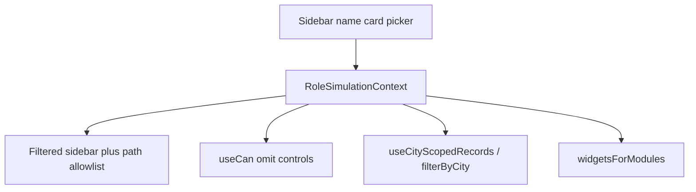

# Role Simulation

This document is the playbook for simulating roles in MaxOne FleetOps. Follow it when adding or changing a role so nav, actions, list data, and the dashboard stay consistent.

This is **frontend simulation**, not backend RBAC. There is no server-side authorization. Switching the sidebar name card changes what the UI shows. The choice is stored in `localStorage` under `maxone.simulationMode`.

## Table of contents

- [Mental model](#mental-model)
- [Key files](#key-files)
- [Conventions](#conventions)
- [Current roles](#current-roles)
- [Permission catalog](#permission-catalog)
- [Nav item ids](#nav-item-ids)
- [Data scope](#data-scope)
- [Dashboard widgets](#dashboard-widgets)
- [Add a new role](#add-a-new-role)
- [Add a permission key](#add-a-permission-key)
- [Add a city scope](#add-a-city-scope)
- [Add a dashboard widget](#add-a-dashboard-widget)
- [Verify](#verify)
- [Known limitations](#known-limitations)

## Mental model

**Full Build** is the default. App Switcher is on. Every module is visible. Every permission is granted. Data is unscoped (all cities).

A **role** is four things, all defined on `RoleDefinition` in [`src/data/rolePermissions.ts`](../src/data/rolePermissions.ts):

1. **Nav** — `navItemIds`: sidebar item `id`s this role may see (include parent folders).
2. **Actions** — `permissions`: allow-list of `PermissionKey`s. Omit a key to hide the control.
3. **Data scope** — optional `dataScope` (today: `{ type: "city", city: "Lagos" }`). Omit for unscoped data.
4. **Dashboard** — **not** configured on the role. Widgets are derived from `navItemIds` via `MODULE_WIDGETS` in [`src/data/dashboardWidgets.ts`](../src/data/dashboardWidgets.ts).



In role mode the App Switcher is hidden. The user stays in Fleet Ops (or whatever `navItemIds` allow). Deep links to hidden modules redirect to a fallback path (`/dashboard` for most roles; `/refurbishment` for Refurbishment Manager and Refurbishment Officer).

## Key files

| File | Role |
|---|---|
| [`src/data/rolePermissions.ts`](../src/data/rolePermissions.ts) | `SimulationMode`, `RoleDefinition`, permission keys, nav allowlist, path allow/deny |
| [`src/contexts/RoleSimulationContext.tsx`](../src/contexts/RoleSimulationContext.tsx) | Mode persistence, `can()`, `dataScope`, `filterByCity`, `useCityScopedRecords` |
| [`src/data/sidebarConfig.ts`](../src/data/sidebarConfig.ts) | Sidebar item `id`s and hrefs |
| [`src/data/cityScope.ts`](../src/data/cityScope.ts) | City matcher and Lagos sub-cities |
| [`src/data/dashboardWidgets.ts`](../src/data/dashboardWidgets.ts) | Widget catalog, module mapping, city-scoped numbers and titles |
| [`src/components/max/Sidebar.tsx`](../src/components/max/Sidebar.tsx) | Name-card picker (`SIMULATION_OPTIONS`) |
| [`src/components/max/AppLayout.tsx`](../src/components/max/AppLayout.tsx) | Nav filter, App Switcher visibility, deep-link guard |
| [`src/main.tsx`](../src/main.tsx) | `RoleSimulationProvider` wraps the app |

## Conventions

Follow these on every new role and every new gated action.

- **Hide, do not disable.** Restricted buttons, columns, and routes are omitted. Do not render a greyed-out control.
- **Permissions are allow-list.** `useCan("x")` is true only if `x` is in the role’s `permissions`. Full Build grants `ALL_PERMISSIONS`. A role with an empty `permissions` array is view-only on every gated control.
- **Ungated pages stay fully usable.** If a page has no `useCan` check, any role that can open the module can perform every action on that page. Only add a permission key when you need to restrict someone.
- **Unmentioned modules stay hidden.** If a leaf is not in `navItemIds`, it is not in the sidebar. Include parent ids when children should show (`inbound` for batches, `asset-reassignment` for kit, `maintenance` for service schedule, `disposal-auction` for disposal children).
- **Widgets belong to leaf modules, not roles.** Do not attach widgets to a `RoleDefinition`. If the role has `fleet-register` in `navItemIds`, it gets the Fleet Register widgets. City-scoped roles keep the same catalog; only numbers, subtitles, and “by City” vs “by Sub-City” titles change.
- **City matching is centralized.** Use `isInCityScope` / `useCityScopedRecords` / `filterByCity`. Do not write `includes("Lagos")` on pages.
- **Ikeja, Lekki, Victoria Island, and Surulere are Lagos sub-cities**, not cities. Dashboard charts for a city-scoped role say “by Sub-City”.
- **Vehicle Master Data (`inbound-stock-setup`) is reference data.** Do not city-filter it.
- **Stat tabs and pagination** must count the filtered set, not the global mocks.
- **Out-of-scope detail URLs** redirect to the module list. Check `filterByCity` on the record’s location or destination.

## Current roles

These are the templates to copy.

| | Full Build | Global Fleet Manager | City Fleet Officer | Fleet Officer | Refurbishment Manager | Refurbishment Officer |
|---|---|---|---|---|---|---|
| Picker label | Full Build | Global Fleet Manager | City Fleet Officer | Fleet Officer | Refurbishment Manager | Refurbishment Officer |
| App Switcher | Yes | No | No | No | No | No |
| Nav | All apps / modules | Fleet Ops allowlist below | Same as GFM | Dashboard, Fleet Register, Activation Readiness, Vehicle Document, Kit | Refurbishment, Service Schedule, all Disposal & Auction children except Predictive Lab | Same as RM |
| Data | All cities | All cities | Lagos only | Ikeja only | All cities | Lagos only |
| Dashboard | All catalog widgets | `fleet-register` + `asset-movement` | Same as GFM, Lagos numbers | `fleet-register` only, Ikeja numbers | **Hidden** (fallback `/refurbishment`) | **Hidden** (fallback `/refurbishment`) |
| Gated Fleet Register | All actions and columns | No Add / Bulk / Edit; hide Contract Risk and Collection % | Same as GFM | Same as GFM | Module hidden | Module hidden |
| Vehicle details Telematics | Yes | Yes | Yes | Hidden | Module hidden | Module hidden |
| Inbound | All mutations | View only | View only | Hidden | Hidden | Hidden |
| Refurbishment part cost | Yes | Hidden | Hidden | Hidden | **Yes** | Hidden |
| Auction / Closed Assets | Yes | Hidden | Hidden | Hidden | **Yes** | **Yes** (Lagos) |
| Predictive Lab | Soon item | Hidden | Hidden | Hidden | Hidden | Hidden |
| Activation / Documents / Kit | All | View only (kit assign blocked for GFM) | Act on update/upload/kit | Same as CFO | Hidden | Hidden |

Hidden for GFM and City Fleet Officer (not in `navItemIds`): Ownership Transfer, Auction, Closed Assets, Predictive Lab, Control, and every non–Fleet Ops app.

Fleet Officer also hides Asset Movement, Inbound, Refurbishment, Maintenance / Service Schedule, and all Disposal & Auction.

Refurbishment Manager and Refurbishment Officer hide Dashboard, Fleet Register, Asset Movement, Inbound, Activation, Vehicle Document, Kit, Ownership Transfer, Predictive Lab, Control, and non–Fleet Ops apps.

Kit assign path `/activation-assignment/asset-reassignment/kit/assign` is denied for **Global Fleet Manager only**. Denied paths for Refurbishment Manager and Refurbishment Officer fall back to `/refurbishment`.

## Permission catalog

Full Build has every key. GFM has telematics only. City Fleet Officer has the six marked below. Fleet Officer has the same five action grants as CFO, without telematics. Refurbishment Manager has part cost only. Refurbishment Officer has no gated keys (part cost hidden).

| Key | Where it is used | Full Build | GFM | CFO | FO | RM | RO |
|---|---|---|---|---|---|---|---|
| `fleetRegister.addVehicles` | [`VehiclesPage.tsx`](../src/pages/VehiclesPage.tsx) — Add Vehicles | Yes | — | — | — | — | — |
| `fleetRegister.bulkUpdate` | [`VehiclesPage.tsx`](../src/pages/VehiclesPage.tsx) — Bulk Update | Yes | — | — | — | — | — |
| `fleetRegister.editVehicle` | [`VehicleDetailsPage.tsx`](../src/pages/VehicleDetailsPage.tsx) — Edit Vehicle Info | Yes | — | — | — | — | — |
| `fleetRegister.column.contractRisk` | [`VehiclesPage.tsx`](../src/pages/VehiclesPage.tsx) — column | Yes | — | — | — | — | — |
| `fleetRegister.column.collectionPercent` | [`VehiclesPage.tsx`](../src/pages/VehiclesPage.tsx) — column | Yes | — | — | — | — | — |
| `inbound.batches.create` | [`BatchesPage.tsx`](../src/pages/BatchesPage.tsx) | Yes | — | — | — | — | — |
| `inbound.batches.addIdentifier` | [`VehicleIdsTab.tsx`](../src/pages/batch-details/VehicleIdsTab.tsx) | Yes | — | — | — | — | — |
| `inbound.batches.editIdentifier` | [`VehicleIdsTab.tsx`](../src/pages/batch-details/VehicleIdsTab.tsx) | Yes | — | — | — | — | — |
| `inbound.batches.uploadCsv` | [`VehicleIdsTab.tsx`](../src/pages/batch-details/VehicleIdsTab.tsx) | Yes | — | — | — | — | — |
| `inbound.batches.uploadDocuments` | [`DocumentsTab.tsx`](../src/pages/batch-details/DocumentsTab.tsx) | Yes | — | — | — | — | — |
| `inbound.batches.moveSubBatchStage` | [`SubBatchDetailsPage.tsx`](../src/pages/SubBatchDetailsPage.tsx) | Yes | — | — | — | — | — |
| `inbound.stockSetup.add` | [`StockSetupPage.tsx`](../src/pages/StockSetupPage.tsx) | Yes | — | — | — | — | — |
| `inbound.stockSetup.edit` | [`StockSetupPage.tsx`](../src/pages/StockSetupPage.tsx) | Yes | — | — | — | — | — |
| `activationReadiness.update` | [`ActivationReadinessPage.tsx`](../src/pages/ActivationReadinessPage.tsx) | Yes | — | Yes | Yes | — | — |
| `activationReadiness.bulkUpload` | [`ActivationReadinessPage.tsx`](../src/pages/ActivationReadinessPage.tsx) | Yes | — | Yes | Yes | — | — |
| `vehicleDocument.upload` | [`VehicleDocumentsPage.tsx`](../src/pages/VehicleDocumentsPage.tsx) | Yes | — | Yes | Yes | — | — |
| `vehicleDocument.replace` | [`VehicleDocumentsPage.tsx`](../src/pages/VehicleDocumentsPage.tsx) | Yes | — | Yes | Yes | — | — |
| `kit.reassignment` | [`KitReportsPage.tsx`](../src/pages/KitReportsPage.tsx) | Yes | — | Yes | Yes | — | — |
| `refurbishment.column.partCost` | [`RefurbishmentPage.tsx`](../src/pages/RefurbishmentPage.tsx) — work order parts Cost column | Yes | — | — | — | Yes | — |
| `vehicleDetails.tab.telematics` | [`VehicleDetailsPage.tsx`](../src/pages/VehicleDetailsPage.tsx) — Telematics tab | Yes | Yes | Yes | — | — | — |
| `championProfile.reassign` | [`ChampionDetailPage.tsx`](../src/pages/ChampionDetailPage.tsx) — Reassign Champion | Yes | — | — | — | — | — |
| `ticketManagement.create` | [`TicketManagementPage.tsx`](../src/pages/TicketManagementPage.tsx) — Create Ticket | Yes | — | — | — | — | — |
| `ticketManagement.reassign` | [`TicketDetailSheet.tsx`](../src/components/max/TicketDetailSheet.tsx) — Reassign Ticket | Yes | — | — | — | — | — |
| `ticketManagement.changeStatus` | [`TicketDetailSheet.tsx`](../src/components/max/TicketDetailSheet.tsx) — Change Status | Yes | — | — | — | — | — |
| `ticketManagement.escalate` | [`TicketDetailSheet.tsx`](../src/components/max/TicketDetailSheet.tsx) — Escalate | Yes | — | — | — | — | — |
| `ticketManagement.close` | [`TicketDetailSheet.tsx`](../src/components/max/TicketDetailSheet.tsx) — Close Ticket | Yes | — | — | — | — | — |
| `ticketManagement.addComment` | [`TicketDetailSheet.tsx`](../src/components/max/TicketDetailSheet.tsx) — Add Comment | Yes | — | — | — | — | — |

Call Centre Agent receives `ticketManagement.create`, `ticketManagement.changeStatus`, `ticketManagement.close`, and `ticketManagement.addComment`. Reassign and Escalate remain hidden.

When you add a key, add it to the `PermissionKey` union **and** `ALL_PERMISSIONS`. Then grant it only on the roles that should have it.

## Nav item ids

Filter the sidebar by item **`id`**, not by label. Source of truth: [`src/data/sidebarConfig.ts`](../src/data/sidebarConfig.ts).

Fleet Ops ids used by GFM / City Fleet Officer:

```
dashboard
fleet-register
asset-movement
inbound
inbound-batches
inbound-stock-setup
activation-readiness
vehicle-document
refurbishment
maintenance
service-schedule
disposal-auction
disposal-management
conversion-request
scrap-management
asset-reassignment
asset-reassignment-kit
```

Fleet Officer ids:

```
dashboard
fleet-register
activation-readiness
vehicle-document
asset-reassignment
asset-reassignment-kit
```

Refurbishment Manager / Refurbishment Officer ids:

```
refurbishment
maintenance
service-schedule
disposal-auction
disposal-management
conversion-request
auction
scrap-management
closed-assets
```

Parents with no href (`inbound`, `maintenance`, `disposal-auction`, `asset-reassignment`) are containers. Include them if any child is allowed. If every child is dropped, the parent is dropped too.

Driver Growth dashboard widgets use leaf id `activation-dashboard` (not in the Fleet Ops list above).

## Data scope

Optional on the role:

```ts
dataScope: { type: "city", city: "Lagos" }
// or
dataScope: { type: "subCity", city: "Lagos", subCity: "Ikeja" }
```

`dataScope` is `null` for Full Build, GFM, and Refurbishment Manager. City Fleet Officer and Refurbishment Officer use Lagos. Fleet Officer uses Ikeja. When set:

- `useCityScopedRecords(records, "location")` (or `"destination"` for batches) filters lists.
- `filterByCity(value)` returns `true` when unscoped; city scope uses `isInCityScope`; sub-city scope uses `resolveLagosSubCity(value) === subCity`.
- Dashboard stats, distribution, and bar charts are derived from the scoped `mockVehicles`.
- Dashboard subtitle names the city or sub-city.

Lagos matcher tokens live in [`src/data/cityScope.ts`](../src/data/cityScope.ts). Treat a string as Lagos if it matches any of: `Lagos`, `Lagos Hub`, `Lagos, Nigeria`, `Nigeria / Lagos`, `Ikeja`, `Ikeja Yard`, `Lekki`, `Victoria Island`, `Surulere`, `Surulere Yard`, `Yaba`, `Gbagada`.

Exclude Accra, Abuja, Kano, Port Harcourt, Ibadan yards (Eleyele, Bodija, Gbagba), Kenya cities, and similar.

`resolveLagosSubCity` maps a location onto the four dashboard sub-cities: Ikeja, Lekki, Victoria Island, Surulere. Generic `"Lagos"` does **not** match a sub-city officer — mock rows for those lists must use a neighborhood name.

### Modules that filter by city

| Module | Field | Notes |
|---|---|---|
| Fleet Register / Vehicle Details | `location` | Out-of-city `/fleet-register/:id` redirects to the list |
| Asset Movement tabs | `location` | Stats recomputed from scoped rows |
| Batches | `destination` | Sub-batches inherit the parent batch |
| Activation Readiness | `location` | |
| Vehicle Documents | `location` | Stats use the scoped set when `dataScope` is set |
| Refurbishment / Service Schedule | `location` | |
| Kit | `location` | |
| Disposal / Conversion / Scrap | `location` | Keep a majority of mock rows in-scope so the module is not empty |
| Auction | `location` | Events, create-auction vehicles, and detail redirects. Location dropdown limited to in-scope depots when `dataScope` is set |
| Closed Assets | `location` | Out-of-city `/closed-assets/:id` redirects to the list |
| Vehicle Master Data | — | **Do not filter** |

Give new mock rows a location/destination the matcher understands. If a city-scoped role would otherwise see zero rows, relabel a majority of the mocks into that city. For a sub-city role, relabel **all** in-scope city-level rows to that sub-city (Fleet Officer: all former Lagos activation / document / kit rows are Ikeja).

## Dashboard widgets

Widgets are published by **leaf module id** in `MODULE_WIDGETS`:

| Module id | Widgets |
|---|---|
| `fleet-register` | Total Fleet, Exit, Active, Inbound, Operational Fleet, Fleet Distribution, Active Fleet by City |
| `asset-movement` | 3PL Check-in, Yard Check-in, Check-in Fleet by City |
| `activation-dashboard` | Activation Queue |
| `champion-360` | Total Champions, Active Champions, Inactive Champions, Champions by City |
| `ticket-management` | Open Tickets, SLA Breached, Resolved Tickets, Ticket Status Breakdown, Tickets by Category |

Driver Experience widgets use `DRIVER_EXPERIENCE_MODULE_WIDGETS` in the same file. Call Centre Agent receives the combined widget sets for `champion-360` and `ticket-management`; unrelated Driver Experience widgets stay hidden.

Driver Experience role data is scoped in [`src/data/driverExperienceAssignmentScope.ts`](../src/data/driverExperienceAssignmentScope.ts). Call Centre Agent Fatima Bello is globally assigned and sees every Champion and ticket in the system. Welfare Agent Chidi Okafor sees only Champions and tickets both assigned to her and located in Lagos. Field Ops Manager and Welfare Manager see every Champion and ticket in Lagos regardless of assignment. Champion lists, Champion details, ticket lists, ticket creation, welfare records, and dashboard metrics must use the centralized scope helpers rather than reading the global mocks directly.

Driver Experience tables expose one geographic level at a time. In Champion Overview, Ticket Management, the Welfare Champions Directory, Agents Portfolio, and Agent Assignment History, global roles and Full Build show a City column and City filter; city-scoped roles show a Subcity column and Subcity filter populated only from their scoped records. Do not show both geographic filters or use the generic “Location” label on these tables. On an Agent Portfolio detail, the Champion Status field is a lifecycle status and must not be labeled as a geographic State.

Across every Driver Experience dashboard mode, Ticket Status Breakdown and Tickets by Category must render side by side in the same two-column row. Do not separate or stack these two charts.

Champions by City and Ticket Aging (SLA) by Agent must render side by side whenever the role can see Ticket Aging. For roles where Ticket Aging is hidden, Champions by City remains full-width. Call Centre Agent is globally scoped and uses Champions by City. Welfare Agent uses Champions by Subcity for its assigned Lagos portfolio.

Reopen Rate by Ticket Category is Full Build-only and must not appear in any simulated role. Full Build renders every available Driver Experience dashboard widget, including both Champions by City and Champions by Subcity; Champions by City remains paired with Ticket Aging.

Welfare Agent dashboard shows exactly: Total Champions, Active Champions, Inactive Champions, Open Tickets, SLA Breached, Resolved Tickets, Ticket Status Breakdown, Tickets by Category, Welfare Follow-Ups Overdue, Welfare Cases, and Champions by Subcity. No other dashboard widgets are visible in this mode.

Welfare Agent uses the Driver Experience sidebar source with `overview-dashboard`, `champion-360`, `ticket-management`, and `welfare`. Its fallback route is `/driver-experience/dashboard`.

Field Ops Manager uses the Driver Experience sidebar source with only `overview-dashboard`, `champion-360`, and `ticket-management`. Its fallback route is `/driver-experience/dashboard`.

In Ticket Management, Field Ops Manager can Reassign Ticket, Change Status, Escalate, Close Ticket, and Add Comment. Create Ticket is hidden, and direct access to `/ticket-management/create` redirects to `/ticket-management`.

Field Ops Manager dashboard shows exactly: Total Champions, Active Champions, Inactive Champions, Open Tickets, SLA Breached, Resolved Tickets, Ticket Status Breakdown, Tickets by Category, Ticket Aging (SLA) by Agent, and Champions by Subcity. Champions by Subcity and Ticket Aging remain on the same row. These reuse existing widgets; no new dashboard widget is created.

Welfare Manager mirrors Full Build across Driver Experience: Dashboard, Champion Overview, Ticket Management, Welfare, Approvals, Agent Portfolio, and Assignment History, with every action permission granted. Drivers Safety Performance and `/driver-safety-score` are excluded. Its data is scoped to Lagos, and the dashboard uses Champions by Subcity. The Welfare Manager dashboard otherwise mirrors Full Build while omitting Avg Safety Score, High Risk Drivers, Driver Risk Distribution, and the Full Build-only Reopen Rate by Ticket Category.

Executive uses the Driver Experience dashboard and can view Champion Overview, Ticket Management, Welfare, and Approvals. All operational actions are unavailable. Agent Management and Drivers Safety Performance are hidden, their routes are denied, and the Executive fallback route is `/driver-experience/dashboard`.

Executive dashboard includes the False Resolution Rate summary card and False Resolution Rate by Resolver. The resolution widgets reuse the Full Build data and presentation. Agent Distribution and Agent Workload are excluded with Agent Management.

On Champion Overview, Executive can view every Champion profile tab except role-restricted information such as Other Info. The profile is read-only: Reassign Champion and Create Time Off are unavailable.

The Champion Biodata Other Info section—Blood Group, Genotype, Champion Date of Birth, Next of Kin, and Next of Kin Phone—is visible only to Welfare Agent, Welfare Manager, and DXP Product Manager. It is hidden for every other simulation mode, including Full Build.

DXP Product Manager has the complete Driver Experience surface except Drivers Safety Performance. Dashboard, Champion Overview, Ticket Management, Welfare, Approvals, and Agent Management are visible, including Agents Portfolio and Assignment History. Safety-related dashboard cards and charts are excluded. Ticket Management retains all actions, while Approvals is view-only with Approve and Reject unavailable. The pending-approvals banner is hidden from Champion Overview. Every Champion profile tab is visible, but Reassign Champion and Create Time Off are unavailable. Agents Portfolio is view-only for reassignment: selection checkboxes and the Reassign action are hidden. On Welfare, the summary cards and Follow-up Queue are hidden; the Champions Directory remains viewable, while Call Champion, Schedule, and Log Note are unavailable.

Operations Manager can access Dashboard, Champion Overview, Ticket Management, and Agent Management, including Agents Portfolio and Assignment History. Approvals, Welfare, and Drivers Safety Performance are hidden and their routes are denied. On a Champion profile, Wallet, Guarantors, and the entire Time-Off section are hidden; Leave History, Create Time Off, and Reassign Champion are unavailable. The role retains full Ticket Management and Agent Management actions.

Operations Manager dashboard includes the existing Ticket Aging (SLA) by Agent widget paired with Champions by City, plus the False Resolution Rate summary card and False Resolution Rate by Resolver widget.

Agent Management publishes exactly two dashboard widgets for roles with Agent Management access and Full Build: Agent Distribution, a donut chart counting agents by operational city; and Agent Workload, a stacked horizontal bar chart showing the top eight agents by assigned Champions with Active, At Risk, Delinquent, and Inactive segments. Agent Distribution must always use each agent's explicit city value rather than state. Agent Workload has one View All action in its top-right corner linking to `/driver-experience/agents/portfolio`.

On Champion details, Field Ops Manager has read-only access to Biodata, Contracts, Asset (including Assignment History and Movement Log), FieldOps History, Guarantors, Tickets, and HMO Details. Wallet, Welfare Notes, and Time-Off are hidden. The role cannot reassign a Champion or perform other Champion actions.

FieldOps History reuses the Fleet Registry status-timeline presentation and provides a maintenance-event dropdown so only one Maintenance record is visible at a time. August event `FO-0841` displays its complete finished breakdown from Awaiting Supply through Completed, with a time range and `5 hrs` for every stage. September event `FO-0972` advances every five seconds through the same stages. Its current stage shows `Current (Ongoing)`; its completed stages show their time range and `5 hrs`.

In Ticket Management, Welfare Agent can Create Ticket, Change Status, Escalate, Close Ticket, and Add Comment. Reassign Ticket remains hidden because `ticketManagement.reassign` is not granted.

On Champion details, Welfare Agent can view Biodata, Contracts, Asset (including Assignment History and Movement Log), Wallet, FieldOps History, Guarantors, Tickets, Welfare Notes, HMO Details, and Time-Off (including Leave History and Create Time Off). Reassign Champion remains hidden because `championProfile.reassign` is not granted.

Champion Profile reassignment uses `ReassignChampionsModal` in single-selection mode: exactly one target agent may be selected and bulk controls such as Select All are hidden. Agent Management keeps the modal's multiple-selection mode for bulk Champion reassignment. This applies anywhere Champion Profile reassignment is permitted, including Full Build and Welfare Manager.

Within the Welfare section, Welfare Agent sees and can use everything available to Full Build. The records remain scoped to Champions assigned to that Welfare Agent.

The Schedule action in the Welfare Champion detail sheet opens the shared `Modal` with the shared `DatePickerField`. Confirming a date updates that Champion's `nextFollowUp` in page state and immediately moves the Champion into the matching Overdue, Due Today, or Upcoming follow-up queue.

A role that has `fleet-register` and `asset-movement` (and not `activation-dashboard`) gets the GFM dashboard: no Activation Queue; the two city charts sit in a two-column grid.

Fleet Officer has only `fleet-register`, so 3PL/Yard stats and Check-in by City are omitted.

Refurbishment Manager and Refurbishment Officer have no dashboard module, so the Overview Dashboard is hidden and denied paths fall back to `/refurbishment`.

City-scoped data (`getDashboardWidgetData`):

- Stat cards: counts and % of the scoped fleet, not the hardcoded global 32,400.
- Fleet Distribution: sub-cities, not Global / Nigeria / Ghana / Cameroon. A sub-city role gets a single chart for that sub-city.
- Active / Check-in charts: sub-cities, not other countries. Titles become **Active Fleet by Sub-City** and **Check-in Fleet by Sub-City** via `widgetDisplayTitle`.

Full Build and GFM keep the global widget numbers.

## Add a new role

Do this in order. Skipping the path allowlist is the usual miss.

### 1. Spec the role

Write down, before code:

- Picker label
- Sidebar leaf ids (and required parents)
- Granted `PermissionKey`s (everything else gated stays hidden)
- `dataScope` or none
- Extra denied routes (action pages under an allowed prefix)

Unmentioned modules stay hidden. Ungated pages in allowed modules stay fully usable.

### 2. Register the role

In [`src/data/rolePermissions.ts`](../src/data/rolePermissions.ts):

- Add the id to `SimulationMode`.
- Add a `RoleDefinition` constant (`navItemIds`, `permissions`, optional `dataScope`).
- Return it from `getRoleDefinition`.
- Append it to `SIMULATION_OPTIONS` (picker order).

In [`src/contexts/RoleSimulationContext.tsx`](../src/contexts/RoleSimulationContext.tsx):

- Accept the new id in `readStoredMode()`.

Reuse another role’s `navItemIds` when the spec says “same nav as X”.

### 3. Path allowlist

`getAllowedPathPrefixes` is **hardcoded** and **branches by mode**. It is not derived from `navItemIds`. GFM / City Fleet Officer share one prefix list. Fleet Officer has a shorter list (`/dashboard`, `/fleet-register`, `/activation/readiness`, `/vehicle-document`, kit). Refurbishment Manager and Refurbishment Officer share: `/refurbishment`, `/service-schedule`, `/disposal-management`, `/conversion-request`, `/auction`, `/scrap-management`, `/closed-assets`. Add every list href **and** every detail route under those modules.

If an action lives under an allowed prefix but the role must not open it, add it to `getDeniedPathPrefixes` for that mode and map a sensible fallback in `getFallbackPathForDenied` (GFM kit assign → kit list; Refurbishment Manager / Officer denied paths → `/refurbishment`).

[`AppLayout.tsx`](../src/components/max/AppLayout.tsx) redirects any disallowed pathname.

### 4. Gate new actions (only if needed)

See [Add a permission key](#add-a-permission-key). Do not grant new keys to existing roles unless the spec says so.

### 5. Scope data (only if the role is city-bound)

See [Add a city scope](#add-a-city-scope).

### 6. Dashboard

Usually nothing: widgets follow `navItemIds`. Only add catalog entries if a **new module** should publish widgets. City-scoped numbers and “Sub-City” titles already follow `dataScope`.

## Add a permission key

1. Add the key to the `PermissionKey` union and to `ALL_PERMISSIONS`.
2. Grant it on the roles that may perform the action. Leave it off GFM / CFO unless the spec grants it.
3. On the page, `useCan("the.key")` and **omit** the button, column, or flow. Example:

```tsx
const canEditVehicle = useCan("fleetRegister.editVehicle")

{canEditVehicle && (
  <Button>Edit Vehicle Info</Button>
)}
```

4. If the action is a dedicated route, also deny it in `getDeniedPathPrefixes` for roles that must not deep-link there.

## Add a city scope

Today only `CityId = "Lagos"` exists.

1. Extend `CityId` and `CITY_TOKENS` in [`src/data/cityScope.ts`](../src/data/cityScope.ts). List every mock spelling (hub, yard, `Country / City`, neighborhood).
2. If the dashboard should break that city into neighborhoods, add a resolver like `resolveLagosSubCity` and wire `getDashboardWidgetData` / `widgetDisplayTitle`. For a single-neighborhood role, use `{ type: "subCity", city, subCity }`.
3. Relabel mock data so a majority of rows in each filtered module match the tokens. Empty modules are a spec bug.
4. Filter list pages with `useCityScopedRecords`. Redirect out-of-city details with `filterByCity`. Recompute tab counts and pagination from the scoped set.
5. Do not filter Vehicle Master Data.

## Add a dashboard widget

1. Add the widget to `WIDGET_CATALOG` in [`src/data/dashboardWidgets.ts`](../src/data/dashboardWidgets.ts).
2. Append its id to `MODULE_WIDGETS` under the **leaf module** that owns it (`fleet-register`, `asset-movement`, `activation-dashboard`, or a new leaf id that also appears in some role’s `navItemIds`).
3. Provide global numbers in `STAT_WIDGET_DATA` / `BAR_CHART_WIDGET_DATA` (or equivalent).
4. If city-scoped roles should show different numbers or titles, handle that in `getDashboardWidgetData` and `widgetDisplayTitle`.

Do not add the widget to `RoleDefinition`.

## Verify

Switch the name card to the new role and check:

- [ ] Picker shows the new label; it persists after reload
- [ ] App Switcher is hidden (role mode) or visible (Full Build)
- [ ] Sidebar matches `navItemIds` only
- [ ] Deep links to hidden modules redirect
- [ ] Denied action routes redirect to the fallback
- [ ] Gated controls are omitted, not disabled
- [ ] Ungated modules in the allowlist still have their actions
- [ ] City-scoped lists, tabs, and pagination use the filtered set
- [ ] Out-of-city detail URLs redirect to the module list
- [ ] Dashboard widgets match the role’s modules; city roles use scoped numbers and Sub-City titles
- [ ] Full Build and other roles are unchanged

## Known limitations

- **Path prefixes are not derived from nav.** Updating `navItemIds` without `getAllowedPathPrefixes` leaves deep links open or blocks valid detail pages. Always edit both.
- **No city switcher in the UI.** A City Fleet Officer is Lagos-only. Another city is a new role or a new `dataScope.city`, not a dropdown.
- **Simulation is client-only.** Anyone can switch roles from the name card. Do not treat this as security.
- **Ungated equals allowed.** Service Schedule and Disposal have no permission keys. Any role that can open those modules can use every control on them until you add keys. Refurbishment gates the work-order parts Cost column via `refurbishment.column.partCost`.
